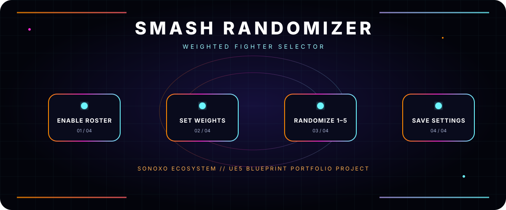

# SMASH RANDOMIZER

**WEIGHTED FIGHTER SELECTOR**

## What it does

An Unreal Engine 5 Blueprint project for choosing one to five random Super Smash Bros. Ultimate fighters.

- Enable or disable the 86-fighter roster and supported alternates.
- Use normal random selection or weighted random selection.
- Adjust every character’s weight manually.
- Increase a selected character’s weight so it becomes less likely in later weighted selections.
- Save weights and enabled/disabled choices between launches.

## Open the project

1. Install a compatible Unreal Engine 5 version.
2. Clone or download the repository.
3. Open `SmashRandomiser.uproject`.
4. Allow Unreal Engine to prepare project assets if prompted.

The repository includes a project screenshot at [SmashRandomiser.png](SmashRandomiser.png).

## Status

A UE5 Blueprint portfolio project. No packaged release, active online service, or current-platform compatibility guarantee is claimed in this README.

## Original creator credit

The project was created by **Anthony Johansen-Barr** as a personal weighted character selector and Unreal Engine Blueprint portfolio piece. Visit the creator’s [portfolio](https://anthonyjb.carbonmade.com/).

This Sonoxo visual refresh preserves that authorship and does not claim Sonoxo created the underlying project. Super Smash Bros. and its characters are properties of their respective rights holders.

---

**SONOXO ECOSYSTEM** · Built to make complex tools understandable

The header animation automatically becomes static when your system requests reduced motion.

